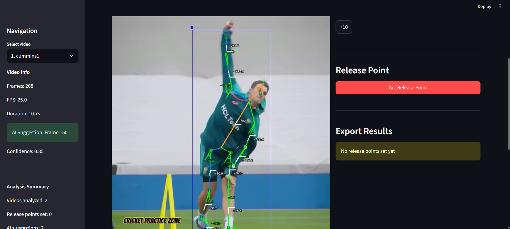
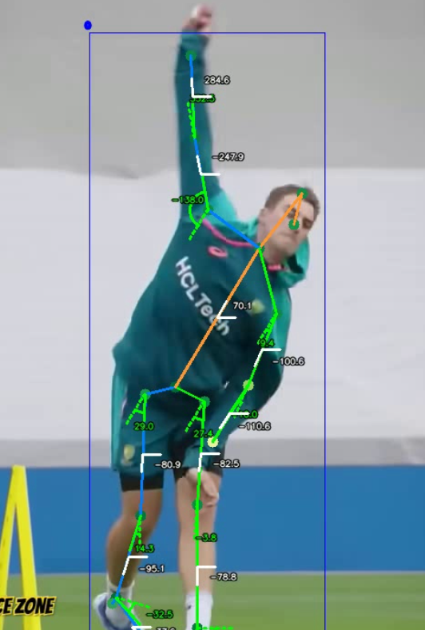

# 🏏 Cricket Video Analysis System

**Turn your cricket bowling videos into detailed biomechanical insights using AI**

Ever wondered exactly when a bowler releases the ball? Or wanted to compare bowling techniques across different players? This system uses cutting-edge computer vision to analyze cricket bowling actions and provide precise, data-driven insights.

## 📸 See It In Action


*Real-time pose estimation with joint angle measurements and AI-powered release point detection*

 
*Frame-by-frame analysis showing complete biomechanical breakdown of bowling action*

## ✨ What Does It Do?

Think of this as your personal cricket analyst that never gets tired. Point it at a bowling video, and it will:

- **🎯 Automatically detect** the exact moment the ball is released
- **📐 Calculate joint angles** throughout the bowling action  
- **📊 Generate detailed reports** comparing different bowlers
- **🔍 Provide frame-by-frame analysis** of the entire motion
- **📈 Export data** for further research or coaching insights

Perfect for coaches, players, researchers, or cricket enthusiasts who want to dive deep into the mechanics of bowling.

## 🚀 Quick Start

Getting started is easy! Just run one command:

```bash
# Launch the web interface - point, click, and analyze!
python main.py --mode ui
```

Or if you prefer the command line:

```bash
# Analyze multiple videos at once
python main.py --mode backend --videos bowler1.mp4 bowler2.mp4 bowler3.mp4
```

That's it! The system will process your videos and give you detailed insights.

## 📦 Installation

First, make sure you have Python installed, then:

```bash
# Install everything you need
pip install -r requirements.txt

# You're ready to go!
python main.py --help
```

## 🎮 How to Use

### Method 1: Web Interface (Recommended for beginners)
```bash
python main.py --mode ui
```

**What you'll see:**
- **Navigation Panel**: Select videos and view analysis summary
- **AI Suggestions**: Automatic release point detection with confidence scores
- **Interactive Display**: Click through frames to see the complete bowling action
- **Real-time Analysis**: Joint angles and pose estimation overlays
- **Export Tools**: Download CSV reports and detailed analysis


*Key features: AI suggestion (Frame 150, 85% confidence), pose tracking, and export capabilities*

### Method 2: Command Line (Great for batch processing)
```bash
# Basic analysis
python main.py --mode backend --videos my_bowling_video.mp4

# Advanced: Set specific release points and export everything
python main.py --mode backend \
  --videos cummins.mp4 bumrah.mp4 rabada.mp4 \
  --release-frames 120 95 110 \
  --export-all
```

## 🧠 The AI Behind It

The system combines several smart technologies:

- **Sports2D**: Tracks body movements and calculates joint angles
- **YOLOv8**: Spots the ball and bowler in each frame
- **Smart algorithms**: Determine exactly when the ball leaves the hand
- **Statistical analysis**: Compares different bowling actions

All of this happens automatically - you just provide the video!

## 📋 What You Get

### Instant Analysis
- **Release point detection**: "The ball was released at frame 145 (4.83 seconds)"
- **Confidence scores**: "AI is 87% confident in this prediction"
- **Joint angles**: Complete biomechanical breakdown

### Visual Insights
The interface shows you exactly what's happening:
- **Pose skeleton**: Green lines showing body structure
- **Joint angles**: Precise measurements at each joint
- **Release detection**: AI identifies the optimal release frame
- **Frame navigation**: Step through the entire bowling action

### Detailed Reports
```csv
Video,Release Frame,Right Elbow Angle,Left Knee Angle,Hip Rotation...
cummins.mp4,145,156.7°,142.3°,23.1°...
bumrah.mp4,132,148.2°,138.9°,19.7°...
```

### Comparison Insights
- See how different bowlers compare
- Identify technique patterns
- Spot areas for improvement

## ⚙️ Customization

Want to fine-tune the analysis? Edit the `config.toml` file:

```toml
# Quick and dirty analysis
[profiles.fast]
sports2d.mode = "fast"
save_images = false

# Research-quality analysis  
[profiles.research]
sports2d.mode = "accurate"
yolo.confidence_threshold = 0.15
save_everything = true
```

## 🔧 For Developers

The system is built with a clean, modular architecture that's easy to extend:

```
🏗️ Project Structure
├── 📁 core/                    # Main analysis engine
├── 📁 utils/                   # Specialized components  
│   ├── video_analyzer.py    # Sports2D integration
│   ├── release_point_detector.py  # AI detection magic
│   └── result_generator.py      # Data export wizardry
└── 📁 ui/                      # Streamlit web interface
```

### Want to integrate with your own app?

```python
from core.analyzer import CricketAnalyzer

# It's this simple
analyzer = CricketAnalyzer()
result = analyzer.analyze_video("my_video.mp4")

print(f"AI suggests release at frame: {result.suggested_release_frame}")
```

### Building your own interface?

The system works with any framework:

```python
# Flask
@app.route('/analyze')
def analyze():
    result = analyzer.analyze_video(request.json['video'])
    return {"release_frame": result.suggested_release_frame}

# FastAPI  
@app.post("/analyze")
async def analyze(video: UploadFile):
    result = analyzer.analyze_video(video)
    return {"analysis_complete": True}
```

## 🎯 Use Cases

**For Coaches:**
- Compare your players' techniques
- Identify areas needing work
- Track improvement over time

**For Players:**
- Analyze your own bowling action
- Compare with professional bowlers
- Fine-tune your technique

**For Researchers:**
- Biomechanical studies
- Technique analysis
- Performance correlation research

**For Cricket Fans:**
- Settle debates about bowling actions
- Understand what makes great bowlers great
- Satisfy your curiosity about the game

## 🎥 Live Demo

Here's what you'll see when analyzing a bowling action:

1. **Upload your video** → System extracts frames automatically
2. **AI analyzes each frame** → Pose detection and joint angle calculation
3. **Release point suggestion** → "Frame 150 detected with 85% confidence"
4. **Interactive exploration** → Click through frames to see the complete action
5. **Export your data** → Download CSV reports for further analysis

## 🤝 Contributing

Found a bug? Have an idea? The modular design makes it easy to contribute:

1. **Add new analysis features** → Create modules in `utils/`
2. **Build new interfaces** → Add them in `ui/`
3. **Improve AI detection** → Enhance the detector algorithms
4. **Add export formats** → Extend the result generator

## 📄 What's Under the Hood

This system brings together several advanced technologies:

- **Computer Vision**: YOLOv8 for object detection
- **Pose Estimation**: Sports2D for biomechanical analysis  
- **Machine Learning**: AI algorithms for release point detection
- **Data Processing**: Statistical analysis and comparison tools
- **Web Technologies**: Modern, responsive interface

But you don't need to understand any of that to use it - it just works!

## 🎉 Ready to Analyze?

Whether you're a coach looking to help your players improve, a researcher studying biomechanics, or just a cricket fan who loves diving deep into the game, this system gives you the tools to understand bowling actions like never before.

```bash
# Let's get started!
python main.py --mode ui
```

---

*Built with ❤️ for cricket analysis and research* 